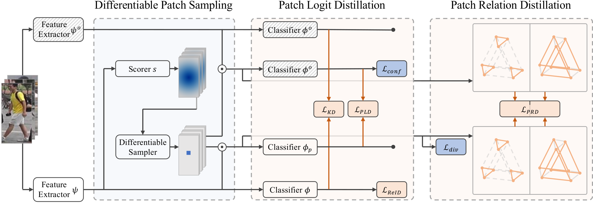

# PatchKD
Code for ACM MM 2022 paper [Patch-based Knowledge Distillation for Lifelong Person Re-Identification](http://www.muyadong.com/paper/acmmm22_sunzc.pdf).



## Installation. I recommend using conda environment for creating environment and installing the packages.
```shell
pip install -r requirements.txt
```

Install Pytorch (Prefferably with CUDA). Example of installing with conda:
```shell
conda install pytorch torchvision torchaudio pytorch-cuda=12.4 -c pytorch -c nvidia
```

Please follow [Torchreid_Datasets_Doc](https://kaiyangzhou.github.io/deep-person-reid/datasets.html) to download datasets and unzip them to your data path (we refer to 'machine_dataset_path' in train_test.py). Alternatively, you could download some datasets from [light-reid](https://github.com/wangguanan/light-reid) and [DualNorm](https://github.com/BJTUJia/person_reID_DualNorm).

## Quick Start
Training + evaluation on Market1501 dataset. Make sure the visdom server is listening.
```shell
python train_test.py
```

Evaluation from checkpoint:
```shell
python train_test.py --mode test --resume_test_model /path/to/pretrained/model
```

Visualization from checkpoint:
```shell
python train_test.py --mode visualize --resume_visualize_model /path/to/pretrained/model
```

## Citation
```
@inproceedings{sun2022patch,
    author = {Sun, Zhicheng and Mu, Yadong},
    title = {Patch-based Knowledge Distillation for Lifelong Person Re-Identification},
    booktitle = {Proceedings of the 30th ACM International Conference on Multimedia},
    pages = {696--707},
    year = {2022}
}
```

## Acknowledgement
Code is based on the implementation of [PatchKD](https://github.com/feifeiobama/PatchKD).